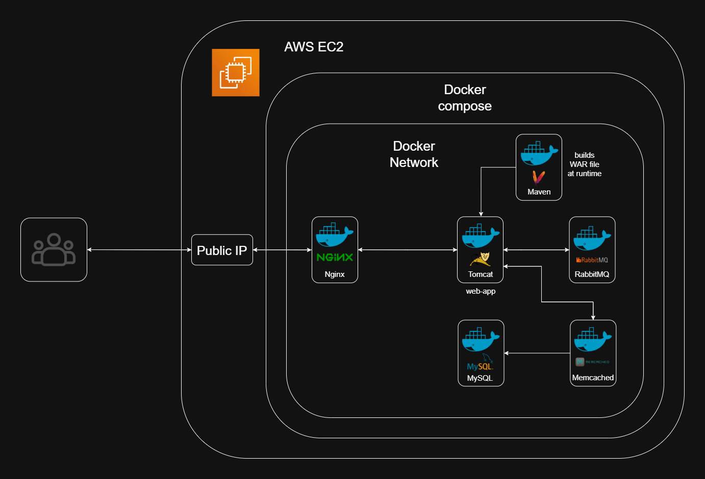

## 🚀 Project 1: Dockerized Microservices App with NGINX Reverse Proxy

This project marks the first milestone in a self-designed 3-project DevOps system that mirrors the real-world progression of DevOps workflows:

Containerization ➝ Orchestration ➝ Automation + CI/CD + Monitoring.

Here, the focus is on containerization — taking a multi-component Java-based application and deploying it as isolated, reproducible, and easily portable containers using Docker and Docker Compose.
---------------------------------------------------------------------------------------------------------------------------
## 📌 Overview

•	Containerizes a Java web application with backend services into individual Docker containers
•	Uses a multi-stage Dockerfile to simulate real-world Java build pipelines with Maven and Tomcat
•	Includes NGINX as a reverse proxy, routing HTTP traffic to the app container
•	Services are deployed and managed via Docker Compose
•	Built and tested on a real AWS EC2 instance (t2.medium) using Ubuntu 24.04 LTS
•	Seed data injected into MySQL container at startup using backup .sql file

This project serves as the foundation layer, upon which Projects 2 and 3 build orchestration, automation, and observability.
---------------------------------------------------------------------------------------------------------------------------
## 💡 Thoughtful Project Design: 3-Project System

These projects weren’t random — they were deliberately designed to mirror the real-world DevOps lifecycle:

 Stage	            Project	         Focus
🧱 Foundation	    Project 1	    Dockerization, NGINX, networking, and environment bootstrapping on cloud infrastructure
🕸️ Orchestration	 Project 2	     Kubernetes, multi-pod architecture, ingress, storage, secrets on cloud infrastructure
⚙️ Automation	    Project 3	    Terraform, CI/CD, observability with Helm, Prometheus, Grafana

By designing this staged system, I created an opportunity to go deeper rather than broader — each project builds atop the last in terms of tooling, complexity, and cloud-native maturity.
---------------------------------------------------------------------------------------------------------------------------
## Architecture diagram

---------------------------------------------------------------------------------------------------------------------------
## 🧱 Application Stack

Service	           Description
web-app	           Java-based frontend served via Tomcat
mysql	           Relational database storing user and app data
rabbitmq	       Messaging system (used for background processing)
memcached	       In-memory caching system
nginx	           Reverse proxy for HTTP traffic to web app
---------------------------------------------------------------------------------------------------------------------------
## 🐳 Containerization
•	Multi-Stage Dockerfile builds app via Maven and packages .war into Tomcat
•	Dockerfiles written for:
o	web-app: multi-stage build (Maven → Tomcat)
o	mysql: copies .sql seed data, sets env vars
•	NGINX container uses default.conf for reverse proxy configuration
•	Uses Docker Compose for multi-container orchestration, volume binding, and network setup
•	.sql seed data automatically initializes MySQL container
---------------------------------------------------------------------------------------------------------------------------
## ☁️ Deployment Environment
Platform	      Details
Cloud Platform	  AWS EC2 (t2.medium)
OS Image	      Ubuntu 24.04 LTS
Docker Setup	  Docker + Docker Compose (v2)
Access Method	  SSH + Git Bash / Terminal
Networking	      Inbound port 80 (HTTP) exposed

Intentional Design Choice:
Used real AWS infrastructure to simulate real-world cloud provisioning — this was not done locally to maximize cloud readiness and practice debugging on real infrastructure.
---------------------------------------------------------------------------------------------------------------------------
📁 Repository Structure
Project_1/
├── app/
│   ├── Dockerfile
│   ├── src/
│   └── pom.xml
├── mysql/
│   ├── Dockerfile
│   └── db_backup.sql
├── nginx/
│   └── default.conf
├── images/
│   └── Project 1 architecture.png
├── docker-compose.yaml
└── README.md
---------------------------------------------------------------------------------------------------------------------------
🛠️ How to Deploy
1. Clone the repo
git clone https://github.com/<your-username>/project-1-containerized-app.git
cd project-1-containerized-app

2. Build all images
docker compose build --no-cache

3. Run the entire stack
docker compose up -d

4. Access the web app via:
http://<EC2 Public IP>

5. To stop the services:
docker compose down
---------------------------------------------------------------------------------------------------------------------------
🧠 Key Engineering Highlights
•	Multi-Stage Docker Builds: Web app uses Maven to build .war before copying into Tomcat — simulates real-world CI flow
•	NGINX Reverse Proxy: Routes all HTTP requests to web-app container on port 8080
•	Seed Data in MySQL: db_backup.sql is auto-imported via custom Dockerfile
•	Docker Networking: All containers communicate over a bridge network with aliasing
•	Minimal Java Knowledge, Maximum Docker Focus: App is treated as a black-box to sharpen focus on DevOps/containerization
---------------------------------------------------------------------------------------------------------------------------
🧪 Real-World Debugging Faced
•	🛠️ MySQL authentication issues: Initially, login failed due to improperly passed environment variables for root credentials. Resolved by directly hardcoding passwords in the Dockerfile (only for dev/testing).
•	🛠️ .env file not picked up: Tried using a .env file for better secret management, but Docker Compose didn’t load it correctly due to scope and syntax mismatches. The solution was to move sensitive config directly into Dockerfile and docker-compose.yaml.
•	🛠️ Web app login failed: Faced login issues after personalizing usernames and passwords. Discovered that passwords were hashed and stored in the MySQL database. Reverted to original password but successfully personalized username, proving an understanding of how the login system worked.
•	🛠️ App branding changed: Changed visible hardcoded values like organization name, login title, and branding references in the Java application source code (.jsp, .properties, etc.). Rebuilt the app Docker image with these updates and confirmed changes in the deployed container.
•	📸 Screenshots collected: Captured and documented proof of app running live with personalized branding and working authentication, verifying the entire DevOps flow end to end.
🔐 Security Notes
•	🔒 Hardcoded credentials were used in the Dockerfile and application.properties for MySQL and web app login. This was a conscious decision made for learning purposes and local testing.
•	⚠️ The .env file approach was attempted but didn’t work reliably within Docker Compose, so values were defined directly.
•	🧪 In production, these values should be passed using secure environment management techniques (Docker secrets, AWS Secrets Manager, Vault, etc.).
---------------------------------------------------------------------------------------------------------------------------
🧭 What This Project Demonstrates
This project is more than just a Docker playground — it was intentionally designed as the foundational step in a 3-project DevOps progression:
•	📦 Project 1: Containerization & deployment of a multi-service app using Docker Compose on AWS EC2
•	☸️ Project 2: Same app orchestrated via Kubernetes (EKS)
•	🛠️ Project 3: Full infrastructure automation, CI/CD, and observability with Terraform, GitHub Actions, and Helm
Specifically, this project demonstrates:
•	✅ Running a full-stack, containerized application with real infrastructure on AWS
•	✅ Building Docker images from multi-stage Dockerfiles, including Maven builds and Tomcat .war deployment
•	✅ Using Nginx as a reverse proxy to expose the application over port 80
•	✅ Configuring MySQL with seed data for the app
•	✅ Troubleshooting real-world deployment issues on cloud infrastructure
---------------------------------------------------------------------------------------------------------------------------
